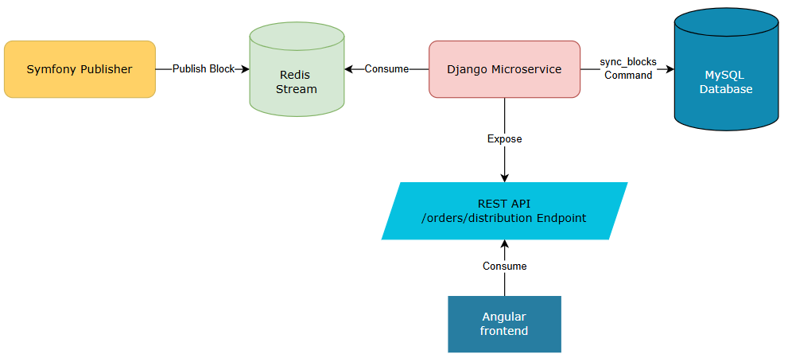
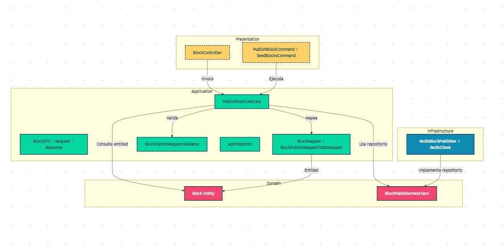
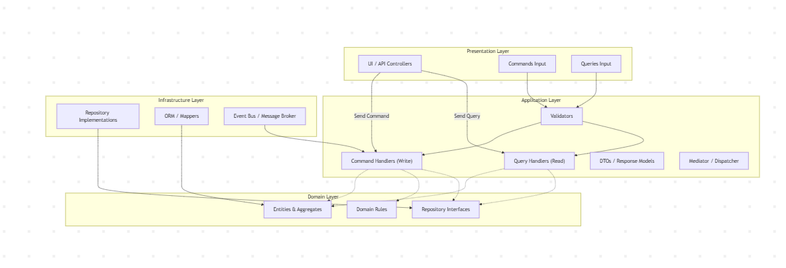

## Arquitectura Técnica

### Diagrama de Arquitectura Principal del Proyecto

### Componentes Principales

| Componente | Forma / Representación | Función                                                                  |
|------------|----------------------|--------------------------------------------------------------------------|
| Symfony Publisher | Rectángulo redondeado (amarillo) | Publica bloques consolidados en Redis                                    |
| Redis Stream | Cilindro (verde) | Canal de eventos para sincronización de datos                            |
| Django Microservice | Rectángulo redondeado (rojo) | Consume eventos de Redis y gestiona la lógica de persistencia y APIs     |
| MySQL Database | Cilindro (azul) | Persistencia de datos                                                    |
| REST API `/orders/distribution` | Rectángulo punteado (cian) | Expone los bloques listos para distribución a Angular                    |
| Angular Frontend | Rectángulo (azul oscuro) | Interfaz de usuario para visualizar órdenes, bloques y estado de entrega |

### Flujos Principales
1. **Publicación de Bloques:**  
   Symfony Publisher → Redis Stream → Django Microservice
2. **Persistencia de Datos:**  
   Django Microservice → MySQL Database (comando `sync_blocks`)
3. **Exposición de Datos:**  
   Django Microservice → REST API `/orders/distribution` → Angular Frontend

---

## Clean Architecture de Symfony

Dentro del microservicio Symfony, seguimos los principios de **Clean Architecture** para mantener separación de responsabilidades y dependencias hacia adentro:

### Capas y Componentes

| Capa | Componente | Función |
|------|------------|---------|
| Presentation | `BlockController`, `PublishBlockCommand`, `SeedBlocksCommand` | Maneja la interacción con usuarios y comandos de consola |
| Application | `PublishBlockUseCase`, `BlockDTO` (request/response), `BlockMapper`, `BlockPublishRequestValidator`, `ApiEndpoints` | Lógica de aplicación: validación, mapeo, coordinación de casos de uso |
| Domain | `Block` (entidad), `BlockPublisherInterface` | Núcleo de negocio independiente, define contratos y entidades |
| Infrastructure | `RedisBlockPublisher`, `RedisClient` | Implementación concreta de persistencia y comunicación con Redis; depende de Domain |

### Flujo de la Clean Architecture

1. **Presentation → Application:**  
   Los controladores y comandos llaman a los casos de uso para ejecutar la lógica.
2. **Application → Domain:**  
   Los casos de uso interactúan con entidades y contratos del dominio.
3. **Infrastructure → Domain:**  
   Las implementaciones concretas (Redis) cumplen los contratos del dominio.
4. **Dependencia hacia adentro:**  
   Domain no conoce ni depende de Application o Infrastructure.

---

## Beneficios de la Arquitectura

- Modularidad y separación de responsabilidades entre frontend, backend y microservicios.
- Flujo asíncrono y escalable mediante Redis.
- Persistencia confiable con MySQL y sincronización controlada mediante comandos (`sync_blocks`).
- API RESTful limpia y consistente para consumo por Angular.
- Interfaz clara y responsive para gestión logística de extremo a extremo.
- Clean Architecture asegura mantenibilidad, testeo fácil y desacoplamiento del dominio.

---
# Django Microservice – CQRS + Clean Architecture

> ⚠️ Nota: El diagrama del microservicio completo es bastante grande. Por eso, se presenta este **diagrama de ejemplo** para entender cómo se implementa **CQRS + Clean Architecture** y la estructura típica de un microservicio en Django.

## ¿Por qué usamos CQRS?

El microservicio de **Django** implementa **CQRS (Command Query Responsibility Segregation)** junto con **Clean Architecture** para separar claramente la **lectura y escritura de datos**, mejorar la mantenibilidad y permitir escalabilidad. Esto permite:

- **Commands:** Gestionar operaciones de escritura y sincronización de bloques logísticos desde Redis hacia MySQL.
- **Queries:** Consultar los datos de órdenes, bloques y distribución para exponerlos mediante la API REST.
- **Separación de responsabilidades:** Los cambios en la lógica de negocio (Commands) no afectan las consultas (Queries) y viceversa.
- **Facilita testing y validaciones:** Cada flujo tiene su propio pipeline de validaciones, mappers y handlers.
- **Integración con Clean Architecture:** Cada capa (Presentation, Application, Domain, Infrastructure) tiene su propósito definido y depende solo de capas internas.

## Diagrama de Arquitectura Ejemplo Clean Architecture + CQRS

## Capas y Componentes

| Capa | Componente | Función |
|------|------------|---------|
| **Presentation** | Controllers (`OrdersController`), Serializers (`OrdersSerializer`, `PagingSerializers`) | Recibe solicitudes HTTP, valida datos de entrada y expone endpoints de consulta y sincronización |
| **Application** | Commands (`SyncBlocksCommand`), Queries (`GetOrdersQuery`), Handlers (`OrdersQueryHandler`), DTOs (`OrdersOutputModel`, `PageSearchArgs`), Mappers (`OrdersMapper`), Validators | Orquesta la lógica de aplicación, transforma datos de input → domain y domain → output, valida reglas de negocio |
| **Domain** | Entidades (`Order`, `Block`, `Driver`, `Product`, `Pyme`, `DistributionCenter`, `Reception`), Enums (`OrderStatus`, `DistributionStatus`), Repositorios (`OrderRepository`) | Núcleo del negocio: define reglas, contratos y modelos independientes de frameworks |
| **Infrastructure** | ORM Models (`models.py`), Repositorios (`OrderRepository`), Mappers de persistencia | Implementación concreta de persistencia en MySQL y mapeo hacia/desde entidades de dominio; depende de Domain |

## Flujo de la Clean Architecture + CQRS

1. **Presentation → Application:**  
   Las solicitudes HTTP llegan a los controladores, que crean Commands o Queries y los envían a los Handlers.

2. **Application → Domain:**  
   Los Handlers ejecutan la lógica de negocio usando entidades, reglas y repositorios del Domain.

3. **Infrastructure → Domain:**  
   La persistencia (ORM/Repositorios) implementa contratos definidos en Domain para guardar y consultar datos.

4. **Dependencia hacia adentro:**  
   Domain no conoce ni depende de Application o Infrastructure.

5. **Queries y Commands separados:**
   - Commands: escritura y sincronización desde Redis → MySQL
   - Queries: lectura de datos para API → Angular

## Beneficios del Microservicio Django

- Separación clara entre lectura (queries) y escritura (commands) gracias a CQRS.
- Integración limpia con Clean Architecture: fácil de mantener y testear.
- Persistencia confiable en MySQL con mappers consistentes entre domain y database.
- API RESTful consistente y paginada para Angular.
- Validaciones y mapeo centralizados en Application e Infrastructure, manteniendo Domain puro.
