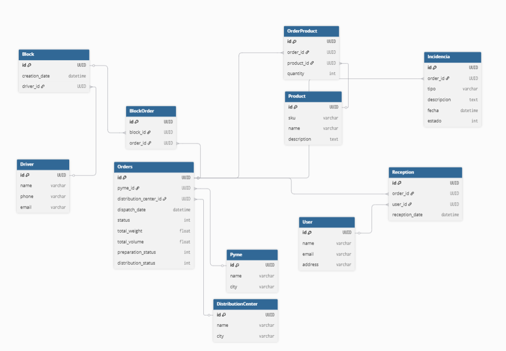

---

# LogisTrack Database

---

## Esquema de Base de Datos

El microservicio utiliza MySQL. A continuación se muestra el **modelo relacional** de la base de datos:

### Tablas principales

**Pyme**

* `id` UUID \[PK]
* `name` varchar
* `city` varchar

**DistributionCenter**

* `id` UUID \[PK]
* `name` varchar
* `city` varchar

**Orders**

* `id` UUID \[PK]
* `pyme_id` UUID \[FK → Pyme.id]
* `distribution_center_id` UUID \[FK → DistributionCenter.id]
* `dispatch_date` datetime
* `status` int *(Enum OrderStatus)*
* `total_weight` float
* `total_volume` float
* `preparation_status` int *(0=pendiente,1=completa)*
* `distribution_status` int *(0=pendiente,1=entregada,2=rechazada)*

**Product**

* `id` UUID \[PK]
* `sku` varchar
* `name` varchar
* `description` text

**OrderProduct**

* `id` UUID \[PK]
* `order_id` UUID \[FK → Orders.id]
* `product_id` UUID \[FK → Product.id]
* `quantity` int

**Block**

* `id` UUID \[PK]
* `creation_date` datetime
* `driver_id` UUID \[FK → Driver.id]

**BlockOrder**

* `id` UUID \[PK]
* `block_id` UUID \[FK → Block.id]
* `order_id` UUID \[FK → Orders.id]

**Driver**

* `id` UUID \[PK]
* `name` varchar
* `phone` varchar
* `email` varchar

**User**

* `id` UUID \[PK]
* `name` varchar
* `email` varchar
* `address` varchar

**Reception**

* `id` UUID \[PK]
* `order_id` UUID \[FK → Orders.id]
* `user_id` UUID \[FK → User.id]  *(usuario que recibe)*
* `reception_date` datetime

**Incidencia**

* `id` UUID \[PK]
* `order_id` UUID \[FK → Orders.id]
* `tipo` varchar
* `descripcion` text
* `fecha` datetime
* `estado` int *(Enum IncidenciaStatus)*

---

### Relaciones

* Un **Order** pertenece a una **Pyme** y a un **DistributionCenter**.
* Un **Order** puede tener muchos **Products** a través de **OrderProduct**.
* Un **Block** está asignado a un **Driver** y puede contener muchas órdenes (**BlockOrder**).
* Cada **Reception** está asociada a un **Order** y a un **User** que la recibe.
* Cada **Incidencia** está asociada a un **Order**.

> Este diseño permite trazar el flujo completo de cada orden desde despacho hasta distribución final, incluyendo preparación, agrupación de órdenes en bloques, asignación a choferes, recepción por usuarios y registro de incidencias.

---
